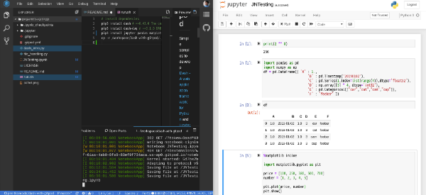

# dash-and-jupyter-notebook-with-gitpod

Simple samples to develop [Dash - A web application framework for Python](https://plot.ly/products/dash/)
and [jupyter-notebook](https://jupyter.org/) applications on [gitpod](https://gitpod.io/). You can develop and analyse everywhere you like!




# Usage

[](https://gitpod.io/#https://github.com/jins-tkomoda/dash-with-gitpod)

## Dash ~ simple sample

Type in terminal: $ `python3 dash_intro.py`

## Dash ~ file-open/upload sample

Type in terminal: $ `python3 file_handling.py`

## jupyter notebook

Type in terminal: $ `jupyter notebook`

After jupyter notebook start-up, you can see a message like followings in terminal.

```
To access the notebook, open this file in a browser:
        file:///home/gitpod/.local/share/jupyter/runtime/nbserver-1516-open.html
Or copy and paste one of these URLs:
        http://(ws-12345678-1234-1234-1234-1234567890ab or 127.0.0.1):8888/?token=abcdef1234567890123456789012345678901234567890
```

Then access http://ws-12345678-1234-1234-1234-1234567890ab:8888/?token=abcdef1234567890123456789012345678901234567890 in browser tab.
(Host name and token will be varied.)

# License

MIT
